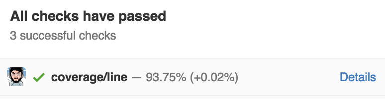
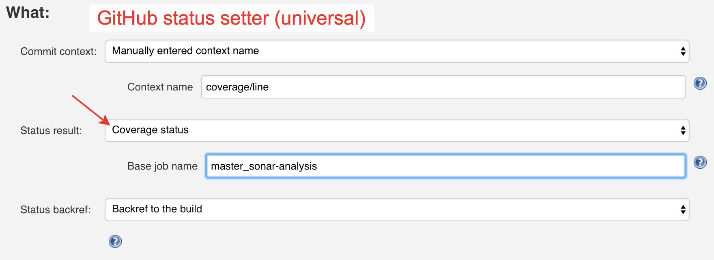

## Reports coverage as status



Based on jacoco action and GitHub plugin's `commit status (universal)` step extension model. 

Requires:
 - GitHub Plugin > `1.19.0`
 - Jacoco publisher enabled

## Setup



### Generated Job DSL example

```groovy
        publishers {
             jacocoCodeCoverage {
                 exclusionPattern('**/path/*.class,**/path2/sub/*.class')
             }
 
             gitHubCommitStatusSetter {
                 commitShaSource {
                     manuallyEnteredShaSource {
                         sha('$GITHUB_PR_HEAD_SHA')
                     }
                 }
                 contextSource {
                     manuallyEnteredCommitContextSource {
                         context('coverage/line')
                     }
                 }
 
                 reposSource {
                     anyDefinedRepositorySource()
                 }
 
                 statusBackrefSource {
                     buildRefBackrefSource()
                 }
 
                 statusResultSource {
                     coverageStatusResultSource {
                         baseJob('master_job')
                     }
                 }
             }
 
             mailer('some@mail.dot', false, true)
         }
```

## Get it

Hosted on [Jucies](https://github.com/jucies/releases)

